

<h1>Análise de <em>churn</em> para uma empresa do setor financeiro 📉💼</h1>
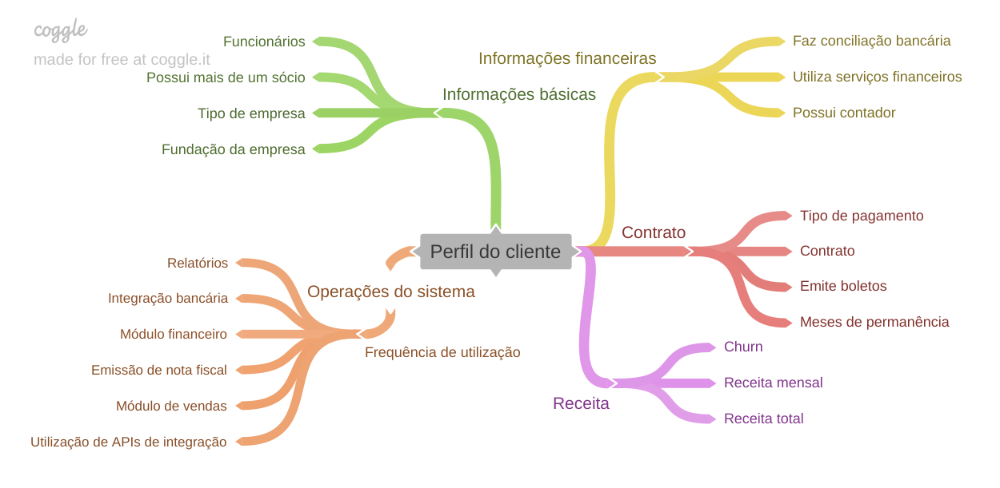

## Contexto 📚

 O <em>*churn*</em>, ou seja, a taxa de cancelamento de clientes, é um desafio crucial para diversas empresas. A perda de clientes pode acarretar em uma significativa redução de receita. Ao contrário da aquisição de novos clientes, que geralmente é mais custosa, a retenção apresenta um custo menor. Diante disso, torna-se essencial identificar os fatores que impulsionam a desistência e implementar estratégias para minimizar o *churn*.

A perda de clientes não se limita apenas à diminuição da receita. Ela também inclui custos adicionais para adquirir novos clientes, bem como a perda da receita recorrente, que contribue para uma previsibilidade financeira a longo prazo. Além disso, o *churn* pode afetar a reputação da empresa, já que consumidores insatisfeitos tendem a compartilhar experiências negativas com outros *leads*.

Para muitas empresas, o modelo de negócio depende significativamente da receita recorrente, proveniente da assinatura dos serviços oferecidos. Mesmo com uma taxa baixa de *churn*, a companhia pode enfrentar impactos consideráveis na receita. A Figura 1 apresenta o fluxo seguido pelos clientes da empresa contratante durante o processo de cancelamento.

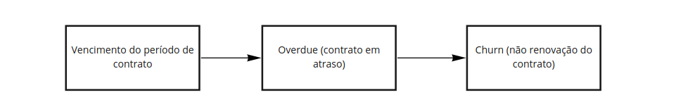
 
<i>Figura 1: Fluxo de cancelamento de clientes</i>

Diante desse cenário, é fundamental descobrir os fatores que levam ao *churn* e implementar estratégias para mitigar esse problema. A empresa contratante busca reconhecer o potencial *churn* com certa antecedência, a fim de tomar medidas preventivas e entender melhor os fatores que impulsionam o cancelamento. Para isso, foram coletados dados de clientes ativos e aqueles que cancelaram o serviço, com o objetivo de desenvolver um modelo preditivo para identificar clientes com maior probabilidade de cancelamento.

## Objetivo 🎯

O objetivo deste projeto é analisar os dados da empresa contratante e desenvolver um modelo preditivo para identificar clientes com maior probabilidade de cancelamento. Para isso, será utilizado um conjunto de dados, contendo informações sobre os assinantes, como quantidade de funcionários, tempo de relacionamento com a companhia, uso do serviço, entre outros.

## Dados 🗄️

O conjunto de dados é composto por 21 colunas e 7043 linhas, sendo `Churn` a variável dependente que desejamos prever. A seguir, uma visão geral das colunas do conjunto de dados:
|Variável|Descrição|Tipo|Escala|
|---|---|---|---|
|`ID`|Identificação do cliente|Qualitativo|Nominal|
|`Tipo de empresa`|Tipo de empresa|Qualitativo|Nominal|
|`Fundação da empresa`|Ano de fundação da empresa|Quantitativo discreto|Racional|
|`Possui mais de um sócio`|Se a empresa possui mais de um sócio|Qualitativo|Nominal|
|`Funcionários`|Número de funcionários|Qualitativo|Ordinal|
|`Meses de permanência`|Quantidade de meses que o cliente permaneceu com o serviço|Quantitativo discreto| Racional|
|`Utiliza serviços financeiros`|Se o cliente utiliza serviços financeiros|Qualitativo|Nominal|
|`PossuiContador`|Se o cliente possui contador|Qualitativo|Nominal|
|`Faz conciliação bancária`|Tipo de conciliação bancária|Qualitativo|Nominal|
|`Frequência de utilização de feature do sistema: Módulo financeiro`|Frequência de utilização de feature do sistema|Qualitativo|Ordinal|
|`Frequência de utilização de feature do sistema: Emissão de nota fiscal`|Frequência de utilização de feature do sistema|Qualitativo|Ordinal|
|`Frequência de utilização de feature do sistema: Integração bancária`|Frequência de utilização de feature do sistema|Qualitativo|Ordinal|
|`Frequência de utilização de feature do sistema: Módulo de vendas`|Frequência de utilização de feature do sistema|Qualitativo|Ordinal|
|`Frequência de utilização de feature do sistema: Relatórios`|Frequência de utilização de feature do sistema|Qualitativo|Ordinal|
|`Frequência de utilização de feature do sistema: Utilização de APIs de integração`|Frequência de utilização de feature do sistema|Qualitativo|Ordinal|
|`Contrato`|Tipo de contrato|Qualitativo|Nominal|
|`Emite boletos`|Se emite boletos, sendo sim ou não|Qualitativo|Nominal|
|`Tipo de pagamento`|Tipo de pagamento|Qualitativo|Nominal|
|`Receita mensal`|Receita mensal do cliente|Quantitativo contínuo|Racional|
|`Receita total`|Receita total do cliente|Quantitativo contínuo|Racional|
|`Churn`|Se o cliente abandonou o serviço|Qualitativo|Nominal|

## Metodologia 📊

Neste projeto, utilizamos dados fornecidos pela empresa interessada. A análise exploratória foi o primeiro passo para compreender o conjunto de dados e identificar possíveis problemas, como valores ausentes, outliers e inconsistências. Durante a etapa de análise exploratória dos dados, identificamos a ausência de valores para as variáveis "**possui contador**" e "**receita total**" em alguns registros, sendo 682 e 11 respectivamente.

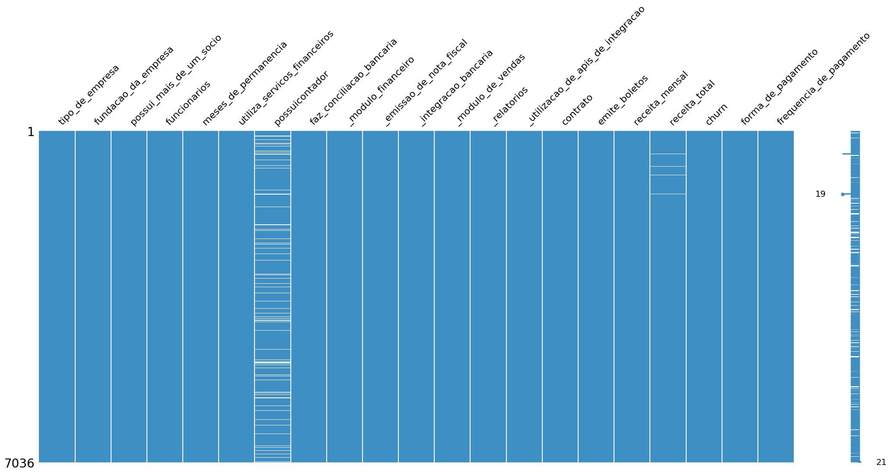
 
<i>Figura 2: Frequência de valores ausentes por variável.</i>

Em nossa investigação, como apresentado Tabela 1, podemos verificar que clientes com receita total ausente tiveram meses de permanência zerados, nos levando a supor que, no momento da coleta, eles haviam adquirido o serviço a pouco tempo.

<i>Tabela 1: Clientes com receita total ausente e meses de permanência zerados.</i>

|   id | tipo_de_empresa   |   fundacao_da_empresa | possui_mais_de_um_socio   | funcionarios           |   receita_total |   meses_de_permanencia | churn   |
|-----:|:------------------|----------------------:|:--------------------------|:-----------------------|----------------:|-----------------------:|:--------|
|  489 | Micro empresa     |                  2019 | Sim                       | 6 ou mais funcionários |             nan |                      0 | Não     |
|  754 | Pequena empresa   |                  2019 | Não                       | 6 ou mais funcionários |             nan |                      0 | Não     |
|  937 | Micro empresa     |                  2020 | Sim                       | 6 ou mais funcionários |             nan |                      0 | Não     |
| 1083 | Pequena empresa   |                  2020 | Sim                       | 6 ou mais funcionários |             nan |                      0 | Não     |
| 1341 | Micro empresa     |                  2019 | Sim                       | 6 ou mais funcionários |             nan |                      0 | Não     |
| 3332 | Pequena empresa   |                  2016 | Sim                       | 6 ou mais funcionários |             nan |                      0 | Não     |
| 3827 | Pequena empresa   |                  2016 | Sim                       | 6 ou mais funcionários |             nan |                      0 | Não     |
| 4381 | Micro empresa     |                  2017 | Sim                       | 6 ou mais funcionários |             nan |                      0 | Não     |
| 5219 | Pequena empresa   |                  2018 | Sim                       | 6 ou mais funcionários |             nan |                      0 | Não     |
| 6671 | Micro empresa     |                  2016 | Sim                       | 6 ou mais funcionários |             nan |                      0 | Não     |
| 6755 | Pequena empresa   |                  2020 | Não                       | 6 ou mais funcionários |             nan |                      0 | Não     |

Para lidar com os valores ausentes, optamos por preencher os valores ausentes da variável "**receita total**" com o valor da "**receita mensal**" na modelagem, notamos que ao multiplicar a receita mensal pelo tempo de permanência, obtemos um valor próximo da receita total. A Tabela 2 apresenta a comparação entre a receita total corrigida e a receita total original. Quando o total de mês de permanência é igual a 1, a receita total corrigida foi igual a receita mensal.

<i>Tabela 2: Comparação entre a receita total corrigida e a receita total original.</i>

|       |   receita_mensal |   meses_de_permanencia |   receita_total_corrigida |   receita_total |
|:------|-----------------:|-----------------------:|--------------------------:|----------------:|
| count |        7025      |              7025      |                   7025    |         7025    |
| mean  |          64.8319 |                32.4531 |                   2285.39 |         2285.54 |
| std   |          30.0765 |                24.5374 |                   2264.71 |         2266.78 |
| min   |          18.25   |                 1      |                     18.8  |           18.8  |
| 25%   |          35.65   |                 9      |                    399.6  |          402.6  |
| 50%   |          70.4    |                29      |                   1396.8  |         1399.35 |
| 75%   |          89.9    |                55      |                   3792.25 |         3801.3  |
| max   |         118.75   |                72      |                   8550    |         8684.8  |

Com relação a variável "**possui contador**", a razão provável para isso pode ser oriúnda de vários fatores como:

- O cliente não quis informar.
- O atributo poderia não existir na época em que os dados foram coletados.
- Distração do preenchimento do formulário.
- Problemas técnicos na coleta de dados.
- A informação não era conhecida na época da coleta de dados.

### Análise exploratória dos dados

A análise exploratória dos dados foi realizada com o intuito de compreender o comportamento das variáveis e identificar possíveis padrões. A Figura 3 apresenta a distribuição da variável dependente, **churn**, que indica se o cliente cancelou o serviço. Aproximadamente 26,5% dos registros do conjunto de dados correspondem a clientes que cancelaram o serviço.

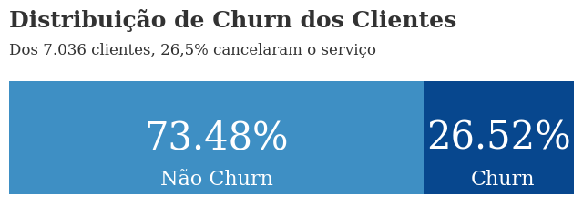
 
<i>Figura 3: Distribuição da variável churn.</i>

A análise comparativa da "**receita mensal**" entre clientes que cancelaram o serviço e aqueles que permaneceram ativos revelou uma diferença na tendência dos dados. Observamos que clientes que tinham uma receita mensal maior tinham mais churn. Já para a variável "**meses de permanência**", notamos que a maioria dos clientes que cancelaram o serviço permaneceu por um período menor em comparação com os clientes ativos. A Figura 4 apresenta um histograma comparativo de todas as variáveis numéricas.

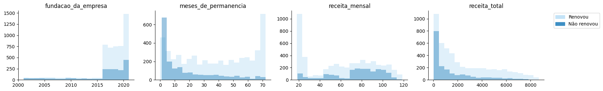
 
<i>Figura 4: Histograma das variáveis numéricas</i>

Com relação as variáveis nominais, há aquelas que se encaixam na frequência de uso do sistema e as demais. Para o uso do sistema, a maioria dos usuários faz *pouco uso* das features do sistema. Quando olhamos por frequência de uso, notamos que os clientes que cancelaram o serviço utilizavam menos as features do sistema em comparação com os clientes ativos. A Figura 5 apresenta um gráfico comparativo da frequência de uso das features do sistema. Daqueles que deram *churn*, a *feature* de *pouco uso* mais utilizada foi o "**módulo financeiro**", seguido pelo "**módulo de vendas**".

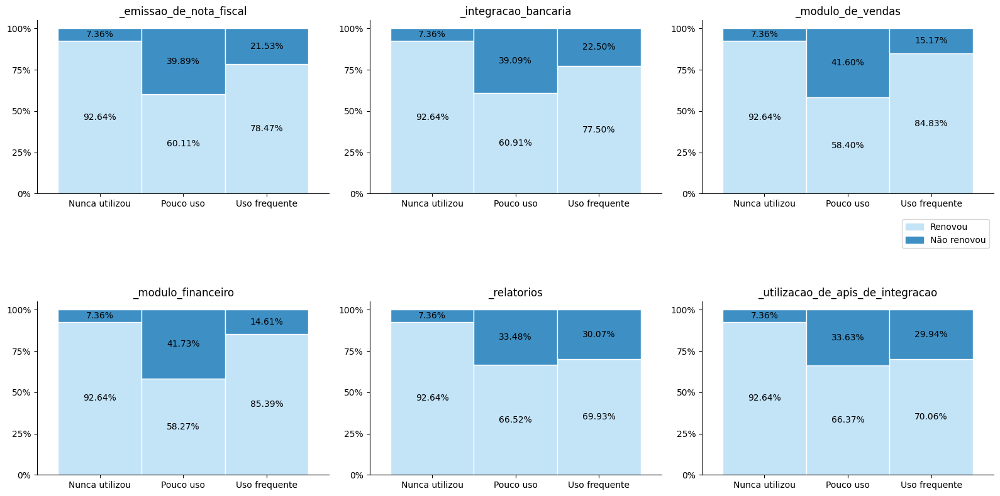
 
<i>Figura 5: Frequência de uso das features do sistema</i>

Já para as demais variáveis nominais, notamos que a maioria dos clientes que cancelaram o serviço tinham **contrato** *mês-a-mês*, *emitiam boletos* e a **forma de pagamento** preferida via *boleto*. A Figura 6 apresenta um gráfico comparativo das variáveis nominais.

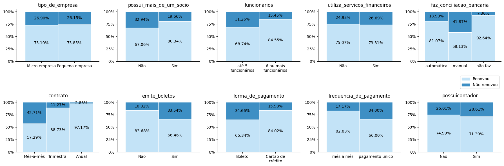
 
<i>Figura 6: Gráfico comparativo das variáveis nominais</i>

Também analisamos a correlação entre algumas das variáveis do conjunto de dados, e notamos que os atributos `meses_de_permanencia` e `receita_total` apresentam uma forte correlação positiva. A Figura 7 apresenta o mapa de calor da matriz de correlação entre as variáveis numéricas.

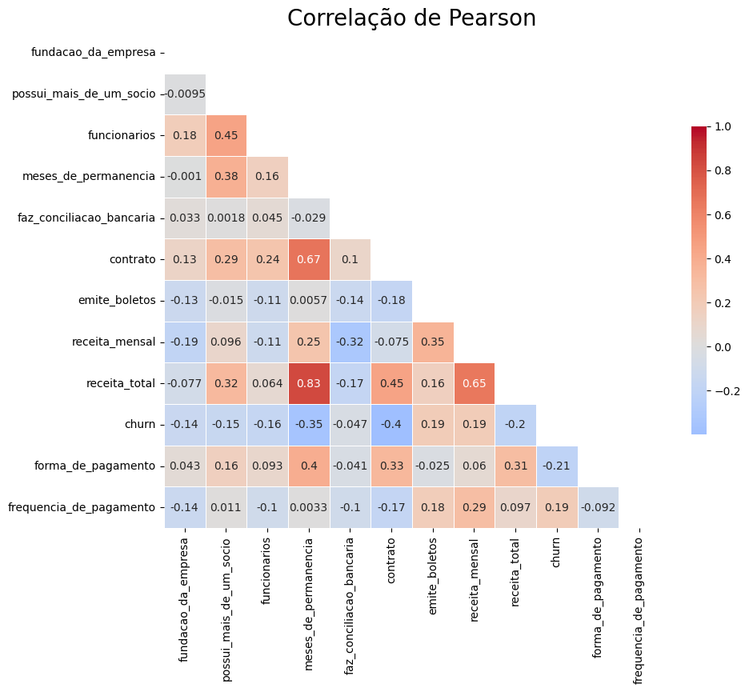
 
<i>Figura 7: Mapa de calor da matriz de correlação</i>

### Modelagem

Começamos dividimos o conjunto de dados em treino e teste, com a proporção de 80% dos dados para treino e 20% para teste.  Para manter a representatividade da variável dependente, realizamos a divisão dos dados de forma estratificada. Fazemos isso para garantir que a distribuição da variável dependente seja mantida em ambas as partições. Na Figura 8, apresentamos um exemplo de como é feita a divisão estratificada dos dados.

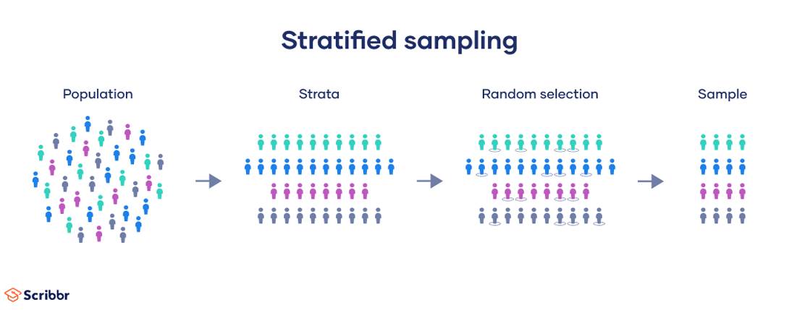
 
<i>Figura 8: Divisão estratificada dos dados. Fonte: <a href="https://www.scribbr.com/methodology/stratified-sampling/">Lauren Thomas (2018)</a></i>

Depois disso, usamos a técnica de k-fold para validação cruzada estratificada nos dados de treino. A validação cruzada é uma técnica que consiste em dividir o conjunto de dados em k partições, treinar o modelo em k-1 partições e testá-lo na partição restante. Devido a natureza desbalanceada do dado (26,5% de churn), testamos abordagens de balanceamento de classe, como a técnica de *oversampling* e *undersampling*. Para avaliar o desempenho dos modelos, usamos a métrica F1 em conjunto com busca de hiperparâmetros por meio do *[optuna](https://optuna.org/)*. Com base na busca de abordagens e modelos, vimos que o balanceamento de classe não melhorou de forma significativa o desempenho dos modelos. A Figura 9 apresenta o desempenho dos modelos com e sem reamostragem.

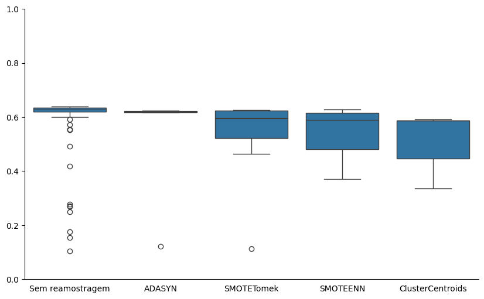
 
<i>Figura 9: Desempenho dos modelos com e sem reamostragem</i>

Com base nos resultados da busca de hiperparâmetros, escolhemos não prosseguir com a reamostragem dos dados. A Figura 10 apresenta o desempenho de cada modelo durante a busca de hiperparâmetros. Vemos que os modelos com melhor desempenho foram a *Regresão Logística*, *SVM Linear* e *LightGBM*.

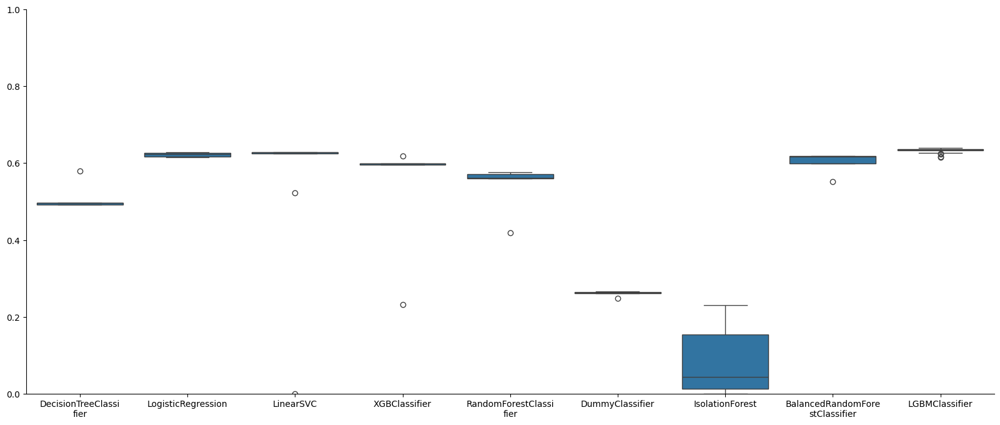
 
<i>Figura 10: Desempenho dos modelos durante a busca de hiperparâmetros</i>

Validamos os melhores modelos sem ajuste de hiperparâmetros, métricas na Tabela 3, na configuração base o *SVM Linear* obteve melhor F1 e cobertura (*recall*).

<i>Tabela 3: Desempenho dos modelos durante a validação cruzada estratificada.</i>

| clf_name           | ('f1_score', 'mean')   | ('f1_score', 'std')   | ('precision_score', 'mean')   | ('precision_score', 'std')   | ('recall_score', 'mean')   | ('recall_score', 'std')   | ('accuracy_score', 'mean')   | ('accuracy_score', 'std')   | ('roc_auc_score', 'mean')   | ('roc_auc_score', 'std')   |
|:-------------------|:-----------------------|:----------------------|:------------------------------|:-----------------------------|:---------------------------|:--------------------------|:-----------------------------|:----------------------------|:----------------------------|:---------------------------|
| LinearSVC          | 62.64%                 | 3.08%                 | 52.24%                        | 2.93%                        | 78.23%                     | 3.4%                      | 75.21%                       | 2.3%                        | 76.18%                      | 2.55%                      |
| LogisticRegression | 62.64%                 | 3.46%                 | 52.53%                        | 3.31%                        | 77.63%                     | 3.84%                     | 75.41%                       | 2.54%                       | 76.12%                      | 2.85%                      |
| LGBMClassifier     | 61.87%                 | 2.5%                  | 53.95%                        | 2.92%                        | 72.6%                      | 2.68%                     | 76.23%                       | 1.95%                       | 75.07%                      | 1.89%                      |
| DummyClassifier    | 29.49%                 | 3.17%                 | 29.42%                        | 2.79%                        | 29.6%                      | 3.74%                     | 62.53%                       | 1.39%                       | 52.01%                      | 2.01%                      |

Na busca de hiperparâmetros que gerou a Figura 10, o melhor modelo selecionado foi o *LGBMClassifier*. A performance atingida foi aproximadamente 64% de F1. A Figura 11 apresenta o desempenho desses modelos durante a busca de hiperparâmetros.

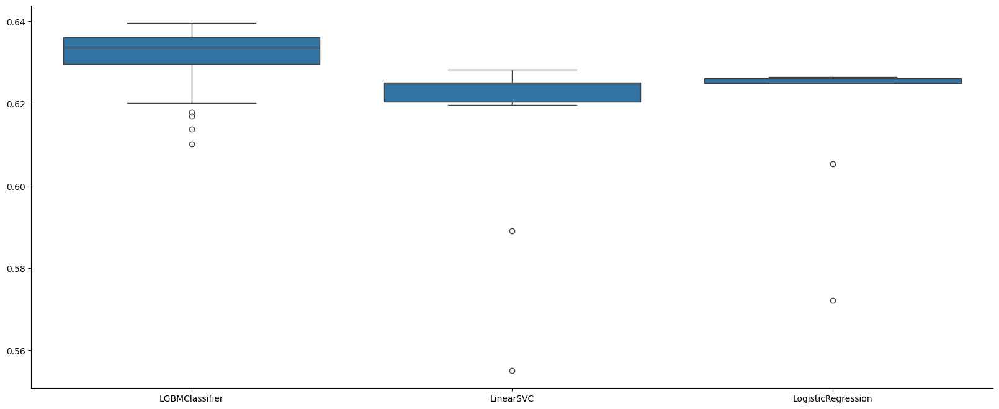
 
<i>Figura 11: Desempenho dos melhores modelos durante a busca de hiperparâmetros</i>

Avaliamos o desempenho dos três modelos no conjunto de teste, conforme mostrado na Tabela 4. O modelo *LGBMClassifier* teve um desempenho um pouco melhor em relação ao *recall* e *F1* em comparação com os demais modelos.

<i>Tabela 4: Desempenho dos modelos no conjunto de teste.</i>

| classifier         | f1     | precision   | recall   | accuracy   | roc_auc   |
|:-------------------|:-------|:------------|:---------|:-----------|:----------|
| **LGBMClassifier**     | **61.28%** | 50.79%      | **77.21%**   | 74.15%     | 75.13%    |
| LogisticRegression | 60.06% | 49.82%      | 75.6%    | 73.37%     | 74.08%    |
| LinearSVC          | 59.94% | 50.0%       | 74.8%    | 73.51%     | 73.92%    |
| DummyClassifier    | 29.4%  | 30.14%      | 28.69%   | 63.49%     | 52.36%    |

Observando a matriz de confusão, constatamos que o modelo destacado conseguiu identificar um pouco mais de clientes que cancelaram o serviço, mas uma diferença pouco relevante. A Figura 12 apresenta a matriz de confusão dos modelos no conjunto de teste.

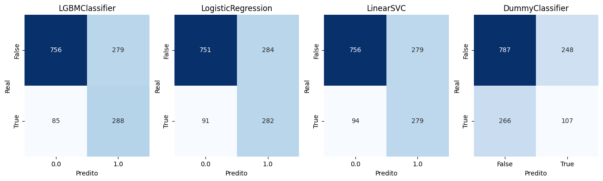
 
<i>Figura 12: Matriz de confusão dos modelos no conjunto de teste</i>

> [!IMPORTANT]
> Todos os modelos foram treinados com o parâmetro `class_weight='balanced'` para lidar com o desbalanceamento da variável dependente.

## Conclusão 📝

Neste projeto, realizamos uma análise de *churn* para uma empresa do setor financeiro. Começamos com uma análise exploratória dos dados, identificando padrões e comportamentos das variáveis. Em seguida, trabalhamos na modelagem, treinando e validando diferentes modelos de classificação. Avaliamos o desempenho dos modelos no conjunto de teste, e o modelo *LGBMClassifier* obteve o melhor desempenho, com aproximadamente 61% de F1.

Com base nas análises realizadas, identificamos que a *receita mensal* e o *tempo de permanência* são variáveis com relação ao *churn*. Assim, recomendamos que a empresa contratante foque em estratégias voltadas a clientes com maior receita mensal e menor tempo de permanência. Por exemplo, incentivar assinaturas de longo prazo (trimestral e anual) oferecendo descontos e benefícios. Também sugerimos a implementação de um programa de fidelidade, recompensando os usuários que utilizam mais as features do sistema ou que permanecem por mais tempo com o serviço.

Importante destacar que esse modelo é uma estratégia auxiliar para identificar clientes com maior probabilidade de cancelamento. Tal ferramenta deve ser utilizada em conjunto com outras estratégias, como pesquisas de satisfação, feedbacks e análises comportamentais. Também é importante ressaltar que o modelo precisa ser avaliado periodicamente, para possíveis ajustes e melhorias.

Como próximos passos, poderíamos investigar o histórico de reclamações e feedbacks dos clientes, com o intuito de identificar tópicos recorrentes e possíveis problemas através de análise de sentimentos. Também podemos considerar a implementação de um modelo de séries temporais para prever o *churn* com base em dados históricos baseados em comportamentos e tendências.
